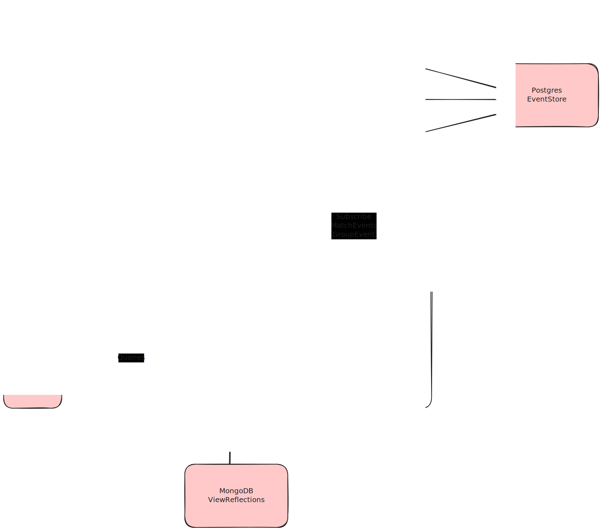

# kick-app


A web application for managing football (soccer/futsal) groups, players, and matches. It allows coaches to create groups, invite players, schedule matches, and track results.

---

## Table of Contents

- [Architecture](#architecture)
- [Tech Stack](#tech-stack)
- [Modules](#modules)
- [Prerequisites](#prerequisites)
- [Local Development Setup](#local-development-setup)
- [Running the Backend](#running-the-backend)
- [Running Tests](#running-tests)
- [CI/CD](#cicd)

---

## Architecture

kick-app uses **Event Sourcing + CQRS**:

- **Write side**: Domain events are persisted in PostgreSQL (partitioned by aggregate ID). Snapshots are stored alongside events.
- **Read side**: MongoDB stores denormalized view/projection documents for fast queries.
- **Inter-module communication**: Spring Modulith application events decouple modules at runtime.



---

## Tech Stack

| Layer | Technology |
|---|---|
| Language | Kotlin 2.1 + Java 21 |
| Framework | Spring Boot 3.5 (WebFlux / reactive) |
| Modularity | Spring Modulith 1.3 |
| Write DB | PostgreSQL 16 via R2DBC + Flyway |
| Read DB | MongoDB (reactive) |
| Auth | Keycloak 25 (OAuth2) or custom JWT filter |
| File Storage | MinIO |
| Mail (dev) | MailHog |
| Containerisation | Docker + Docker Compose |

---

## Modules

The backend is organized into Spring Modulith modules under `com.spruhs.kick_app`:

| Module | Responsibility |
|---|---|
| `group` | Group creation, player invitations, roles and statuses |
| `match` | Match scheduling, player availability, and results |
| `user` | User registration, authentication, and profile images |
| `message` | Internal notifications and mailbox entries |
| `view` | Read-side projections (MongoDB) consumed by REST endpoints |
| `common` | Shared infrastructure: event sourcing base, exceptions, security, value objects |

---

## Prerequisites

- [Docker](https://docs.docker.com/get-docker/) and [Docker Compose](https://docs.docker.com/compose/)
- [JDK 21](https://adoptium.net/) (Temurin recommended)
- [Maven 3.9+](https://maven.apache.org/) (or use the included `mvnw` wrapper)

---

## Local Development Setup

All infrastructure dependencies (PostgreSQL, MongoDB, Keycloak, MinIO, MailHog) are defined in `docker-compose.yml`.

1. Copy the environment file and adjust values if needed:

   ```bash
   cp .env.example .env   # or use the committed .env directly
   ```

2. Start all services:

   ```bash
   docker compose up -d
   ```

   | Service | Port(s) |
   |---|---|
   | MongoDB | `6000` |
   | PostgreSQL | `5432` |
   | Keycloak | `8080` |
   | MinIO API / Console | `9000` / `9001` |
   | MailHog SMTP / UI | `1025` / `8025` |

---

## Running the Backend

```bash
cd backend-kotlin

# Run with default profile (Keycloak OAuth2)
./mvnw spring-boot:run

# Run with custom JWT security profile
./mvnw spring-boot:run -Dspring-boot.run.profiles=jwtSecurity
```

The API will be available at `http://localhost:8080`.  
OpenAPI / Swagger UI is served at `http://localhost:8080/swagger-ui.html`.

---

## Running Tests

Tests use [Testcontainers](https://testcontainers.com/) to spin up MongoDB automatically. PostgreSQL is provided by the CI service container (or your local instance).

```bash
cd backend-kotlin

# Run all tests
./mvnw test

# Build without running tests
./mvnw package -DskipTests
```

---

## CI/CD

| Workflow | Trigger | Action |
|---|---|---|
| **Java** | Push / PR to `main` affecting `backend-kotlin/**` | Runs `mvn test` with a PostgreSQL 15 service container |
| **Docker** | Successful completion of the Java workflow on `main` | Builds and pushes `fspruhs/kick-app-kotlin-backend:latest` to Docker Hub |

Docker Hub image: [`fspruhs/kick-app-kotlin-backend`](https://hub.docker.com/r/fspruhs/kick-app-kotlin-backend)
